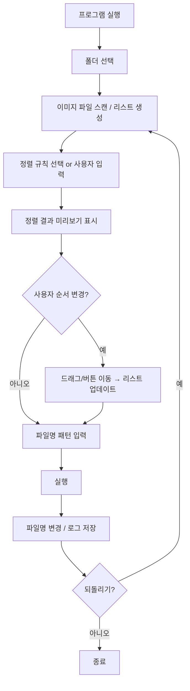

# Renam 📁✨

이미지 파일 정렬 및 일괄 이름 변경 도구 (Windows)

Renam은 이미지 파일을 폴더에서 자동 정렬하고, 사용자가 원하는 규칙으로 일괄적으로 파일명을 변경할 수 있는 GUI 기반 도구입니다.

## 🚀 주요 기능

| 기능 | 설명 |
|---|---|
| 폴더 선택 | Windows 폴더 선택 창 제공 |
| 이미지 필터링 | JPG, PNG 등 확장자 자동 선택 |
| 정렬 규칙 선택 | 숫자, 알파벳, 날짜, 확장자 |
| 사용자 규칙 입력 | 정규식 기반 정렬 키 설정 |
| 실시간 미리보기 | 변경될 파일명을 즉시 표시 |
| 수동 정렬 기능 | 드래그 & 드롭 or ↑↓ 이동 |
| Undo 기능 | 원래 파일명으로 복구 |
| EXE 제공 | 설치 없이 실행 가능 |

## 🖥️ 사용 방법

```
📂 폴더 선택 → 옵션 설정 → 파일 편집 → 실행 완료!
```

### UI 구조

```
┌────────────────────────────────────────────┐
│ Renam                                      │
├────────────────────────────────────────────┤
│ 📂 폴더 선택: [ C:/Users/Pictures ]        │
├────────────────────────────────────────────┤
│ 정렬 규칙                                  │
│ (●) 숫자 기준                              │
│ ( ) 알파벳                                 │
│ ( ) 날짜                                   │
│ ( ) 확장자                                 │
│ ( ) 정규식: [ (\d+) ]                      │
│ [+] 규칙 추가                              │
├────────────────────────────────────────────┤
│ 파일명 패턴: [ {n} ]                       │
│ Example: IMG_{000}, Photo_{00}             │
├────────────────────────────────────────────┤
│ 미리보기                                   │
│ 원본 파일명      → 변경 파일명      ↑ ↓    │
│ IMG_10.png       → 1.png              ↑    │
│ IMG_2.png        → 2.png              ↓    │
│ IMG_1.png        → 3.png                   │
├────────────────────────────────────────────┤
│ [실행] [되돌리기] [종료]                   │
└────────────────────────────────────────────┘
```

## 🛠 기술 스택

- **Python** 3.10+
- **Tkinter** (GUI)
- **os, pathlib, re, shutil** (파일 처리)
- **pyinstaller** (Windows 실행 파일 패키징)

## 📦 설치 & 실행

### EXE 다운로드 → 바로 실행
(추후 링크 제공 예정)

### 개발 환경 직접 실행
```bash
pip install -r requirements.txt
python app.py
```

## 📋 동작 흐름



## 🔧 정렬 로직

| 정렬 기준 | 처리 방식 |
|---|---|
| 숫자 기반 | 정규식으로 숫자 추출 후 정렬 |
| 알파벳 기반 | 기본 문자열 정렬 |
| 생성/수정 날짜 | os.stat 기반 시간 정렬 |
| 확장자 | 확장자 그룹 후 내부 정렬 |
| 사용자 정규식 | Custom key function 적용 |

## 📊 데이터 구조

```json
[
  {
    "original": "IMG_10.jpg",
    "display_name": "IMG_10.jpg", 
    "new_name": "1.jpg",
    "order": 1,
    "ext": "jpg"
  }
]
```

### Undo 데이터 구조

```json
{
  "folder": "...",
  "before": ["IMG_10.jpg", "IMG_01.jpg"],
  "after": ["1.jpg", "2.jpg"],
  "timestamp": "2025-11-21T12:00:00"
}
```

## ⚠️ 예외 처리

| 예외 상황 | 대응 |
|---|---|
| 중복 파일명 발생 | 임시 postfix 붙여 처리 |
| 권한 오류 | Alert 표시 + 작업 중단 |
| 빈 폴더 선택 | 경고 표시 |
| 정규식 오류 | 오류 메시지 + 입력 초기화 |

## 🧩 향후 지원 예정

- [ ] EXIF 촬영일 기준 정렬
- [ ] 썸네일 미리보기 UI
- [ ] 복합 정렬 규칙 설정
- [ ] 파일 제외 규칙

## 📄 라이선스

MIT License

## 🤝 기여하기

Issues와 Pull Requests를 환영합니다!
