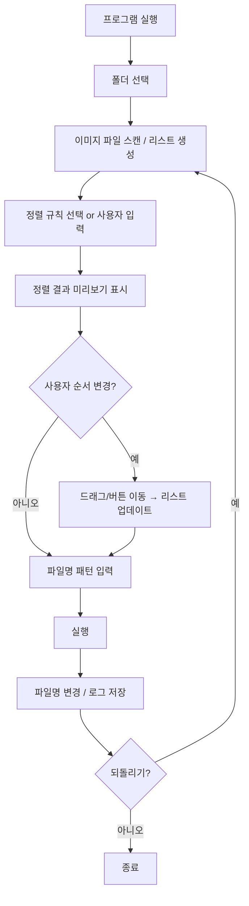

# Renam 📁

이미지 파일 정렬 및 일괄 이름 변경 도구

Renam은 이미지 파일을 폴더에서 자동 정렬하고, 사용자가 원하는 규칙으로 일괄적으로 파일명을 변경할 수 있는 GUI 기반 도구입니다.

**크로스 플랫폼 지원**: Windows, macOS, Linux (Docker 지원)

## 🚀 주요 기능

| 기능            | 설명                                                                                   |
| --------------- | -------------------------------------------------------------------------------------- |
| 폴더 선택       | 크로스 플랫폼 폴더 선택 창 제공                                                        |
| 하위 폴더 모드  | 상위 폴더 선택 시 하위 폴더를 좌측 리스트로 표시, 폴더별로 독립된 설정/미리보기 관리   |
| 이미지 필터링   | JPG, PNG 등 확장자 자동 선택                                                           |
| 정렬 규칙 선택  | 숫자, 알파벳, 날짜, 확장자, 사용자 정규식                                              |
| 정렬 유지       | 이름 변경/되돌리기/초기화/재스캔 후에도 현재 정렬 규칙 자동 재적용 (하위 탭 모드 포함) |
| 파일명 패턴     | `{n}` 등을 이용해 일괄 이름 생성                                                       |
| 실시간 미리보기 | 변경될 파일명을 즉시 표시, `미리보기 > 폴더명` 타이틀로 현재 컨텍스트 표시             |
| 수동 정렬 기능  | ↑↓ 버튼으로 블록 단위 순서 이동                                                        |
| Undo 기능       | 원래 파일명으로 복구 (최근 10개)                                                       |
| 부드러운 UI     | 작은 폰트와 위젯 재사용으로 리스트/테이블 깜빡임 최소화                                |
| Docker 지원     | 웹 브라우저로 GUI 접속 가능                                                            |
| EXE 제공        | Windows 설치 없이 실행 가능                                                            |

## 🖥️ 사용 방법

```
📂 폴더 선택 → 옵션 설정 → 파일 편집 → 실행 완료!
```

### UI 구조

```
Renam

[폴더 선택]
  C:/Users/.../Pictures

[좌측] 하위 폴더 / 옵션
  - 폴더A
  - 폴더B
  - 폴더C

[우측] 미리보기 > 폴더명
  원본 파일명   →   변경 파일명
  001.jpg       →   1.jpg
  002.jpg       →   2.jpg
  ...

[하단]
  [변경]  [되돌리기]  [종료]
```

### 하위 폴더 모드 / 단일 폴더 모드

- **하위 폴더 모드**

  - 선택한 상위 폴더에 하위 폴더가 하나 이상 있을 때 활성화됩니다.
  - 좌측 `하위 폴더` 리스트에서 폴더를 클릭하면 해당 폴더가 **현재 탭**이 되며:
    - 우측 상단 타이틀이 `미리보기 > {폴더명}` 으로 표시됩니다.
    - 정렬 규칙, 파일명 패턴, 미리보기 상태가 폴더별로 독립적으로 저장됩니다.
    - 이름 변경, 되돌리기, 초기화, 재스캔 이후에도 **현재 선택된 정렬 규칙이 자동으로 다시 적용**됩니다.
  - 하단 `[변경]`, `[되돌리기]` 버튼은 **현재 선택된 하위 폴더 하나만** 대상으로 동작합니다.

- **단일 폴더 모드**
  - 선택한 폴더에 하위 폴더가 없을 때 활성화됩니다.
  - 현재 폴더의 모든 이미지 파일을 한 번에 정렬/변경/되돌리기 합니다.
  - 이름 변경, 되돌리기, 초기화 후에도 `_apply_sort`를 통해 현재 정렬 규칙이 유지됩니다.

## 🛠 기술 스택

- **Python** 3.10+
- **Tkinter** (GUI)
- **os, pathlib, re, shutil** (파일 처리)
- **Docker** (컨테이너화)
  - TigerVNC (VNC 서버)
  - noVNC (웹 기반 VNC 클라이언트)
  - Fluxbox (경량 윈도우 매니저)
- **pyinstaller** (Windows 실행 파일 패키징)

## 📦 설치 & 실행

### 🐳 Docker로 실행 (권장 - 모든 플랫폼)

**가장 쉬운 방법! 웹 브라우저로 GUI 접속**

```bash
# 1. 저장소 클론
git clone https://github.com/Hobby2025/Renam.git
cd Renam

# 2. 작업 폴더 생성 (이미지 파일을 여기에 넣으세요)
mkdir workspace

# 3. Docker Compose로 실행
docker-compose up -d

# 4. 웹 브라우저에서 접속
# http://localhost:6080
```

**접속 정보**:

- **웹 UI**: http://localhost:6080 (noVNC)
- **VNC 클라이언트**: localhost:5901 (비밀번호: `renam`)

**파일 작업**:

- `workspace/` 폴더에 이미지 파일을 넣으세요
- GUI에서 `/workspace` 폴더를 선택하세요
- 파일명 변경 후 `workspace/` 폴더에서 결과 확인

**중지 및 제거**:

```bash
# 중지
docker-compose stop

# 재시작
docker-compose start

# 완전 제거
docker-compose down
```

---

### 💻 로컬 환경 직접 실행

**Python 3.10+ 필요**

```bash
# 의존성 설치
pip install -r requirements.txt

# 실행
python app.py
```

---

### 📦 EXE 다운로드 (Windows)

[RENAM 1.0.0](https://github.com/Hobby2025/Renam/releases/download/1.0.0/Renam.exe)

---

### 🧪 테스트 실행

```bash
# 핵심 로직 테스트
python test_logic.py
```

## 📋 동작 흐름



## 🔧 정렬 로직

| 정렬 기준      | 처리 방식                    |
| -------------- | ---------------------------- |
| 숫자 기반      | 정규식으로 숫자 추출 후 정렬 |
| 알파벳 기반    | 기본 문자열 정렬             |
| 생성/수정 날짜 | os.stat 기반 시간 정렬       |
| 확장자         | 확장자 그룹 후 내부 정렬     |
| 사용자 정규식  | Custom key function 적용     |

하위 폴더 모드와 단일 폴더 모드 모두에서 **이름 변경 / 되돌리기 / 초기화 / 재스캔 이후** 현재 선택된 정렬 규칙이 다시 적용되어, 미리보기 순서와 `order` 값이 항상 일관되게 유지됩니다.

## 📊 데이터 구조

```json
[
  {
    "original": "IMG_10.jpg",
    "display_name": "IMG_10.jpg",
    "new_name": "1.jpg",
    "order": 1,
    "ext": "jpg"
  }
]
```

### Undo 데이터 구조

```json
{
  "folder": "...",
  "before": ["IMG_10.jpg", "IMG_01.jpg"],
  "after": ["1.jpg", "2.jpg"],
  "timestamp": "2025-11-21T12:00:00"
}
```

## ⚠️ 예외 처리

| 예외 상황        | 대응                      |
| ---------------- | ------------------------- |
| 중복 파일명 발생 | 임시 postfix 붙여 처리    |
| 권한 오류        | Alert 표시 + 작업 중단    |
| 빈 폴더 선택     | 경고 표시                 |
| 정규식 오류      | 오류 메시지 + 입력 초기화 |

## 🧩 향후 지원 예정

- [ ] EXIF 촬영일 기준 정렬
- [ ] 썸네일 미리보기 UI
- [ ] 복합 정렬 규칙 설정
- [ ] 파일 제외 규칙

## 📄 라이선스

MIT License

## 🤝 기여하기

Issues와 Pull Requests를 환영합니다!
